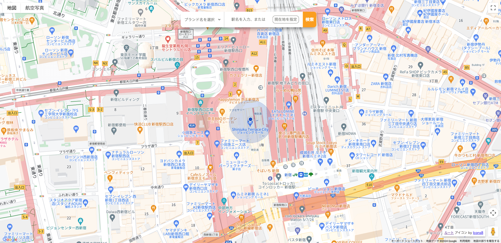
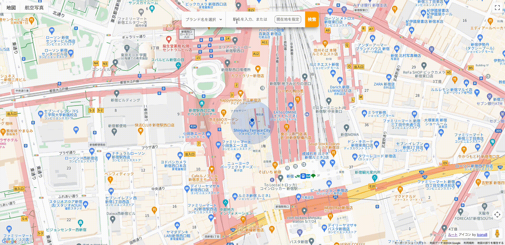

 

## サービスのURL

https://chainstoresearch.com/chainstoresearch

 

## サービスへの想い

このサービスは、私の実体験から生まれました。 
チェーン店で注文する際、私はいつも最安のメニューを選んでいます。ただ、時には少し贅沢したいときもあります。 
そんな時、メインメニューをグレードアップさせるのか、もしくはサイドメニューを足すのか迷ってしまいます。そして、それによって変わる金額を計算していると、後ろの人を待たせてしまうので、結局いつもの最安メニューに落ち着いてしまいます。 
「もうこんな思いはしたくない、メニューをおすすめして決断の手間を減らしてほしい！」 
そんな私の心の叫びから、生まれたサービスです。

 

## アプリケーションのイメージ

 

## 機能一覧
| トップ画面 |　駅名サジェスト |
| - | - |
|  |  |
| 地図上に現在地が表示されます。 | 店舗検索の中心として、駅名の一部を入力すると、駅名候補がサジェストされます。 |

| 店舗検索 |
| - |
|  |
| 現在地、もしくは駅を中心として、半径500m以内にある店舗を検索できます。 |

| ルート検索 |　メニュー表示・シャッフル |
| - | - |
|  |  |
| 現在地から店舗までのルートを表示できます。 | 予算を選択すると、メインメニューを1つ含むメニューが、ランダムで表示されます。 |

 

## 使用技術

| カテゴリー | 技術 |
| - | - |
| フロントエンド | HTML, CSS, JavaScript |
| バックエンド | Java 22.0.2, Spring(Spring Boot 3.2.6/Spring Framework 6.1.8/Spring MVC 6.1.8), MyBatis 3.5.14 |
| データベース | MySQL 8.0.35 |
| API | Google Maps API(Places API / Directions API / Maps API) |
| インフラストラクチャー | Amazon Web Services(VPC/RDS/EC2/Route 53/ACM/ALB) |
| コード管理 | Git 2.45.0, GitHub |
| 開発環境 | Eclipse 4.31.0 |

 

## システム構成図

 

## ER図

 

## 今後の展望

本プロダクトは4つのフェーズに分けて、段階的に開発を進めています。  
現在はフェーズ1として、請求書の作成・発行機能の開発をしています。  
将来的には書類作成業務から経理・会計業務までを一元管理できる、統合的なソリューションの実現を目指しています。  

- フェーズ1：新しい税制に対応した請求書を、Web上で作成・発行できるアプリケーションを開発する。
- フェーズ2：発注書・見積書・納品書を、Web上で作成・発行できる機能を追加する。
- フェーズ3：お金や取引に関するデータをWeb上で確認できる機能を追加する。
- フェーズ4：取引に関するデータを、会計ソフトに効率的に取り込める機能を追加する。
