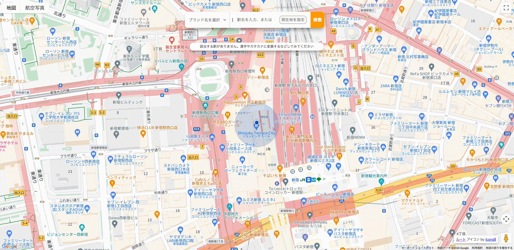
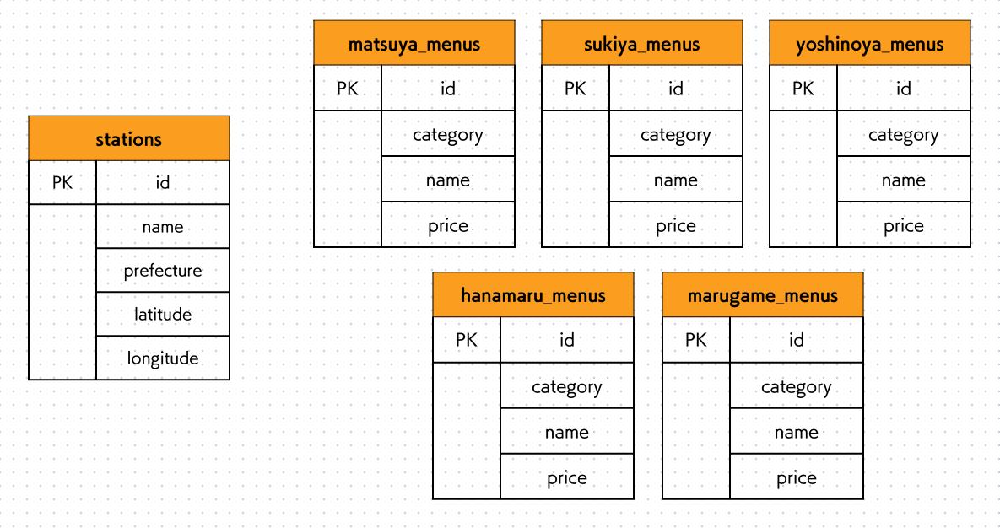

 

## URL

https://chainstoresearch.com/chainstorenavi

 

## サービスへの想い

このサービスは、私の実体験から生まれました。 
チェーン店で注文する際、私はいつも最安値のメニューを選んでいます。ただ、時には少し贅沢したいときもあります。 
そんな時、メインメニューをグレードアップさせるのか、もしくはサイドメニューを足すのか迷ってしまいます。そして、それによって変わる金額を計算していると、後ろの人を待たせてしまうので、結局いつもの最安値メニューに落ち着いてしまいます。 
「もうこんな思いはしたくない、メニューをおすすめして決断の手間を減らしてほしい！」 
そんな私の心の叫びから、生まれたサービスです。 
そして、店舗・ルート検索も盛り込み、チェーン店に行きたい時の煩わしさを、ワンストップで解決できるサービスを目指しました。 

 

## 機能一覧
| トップ画面 |
| - |
| 地図上に現在地が表示されます。 |
|  |

|　駅名サジェスト |
| - |
| 店舗検索の中心として、駅名の一部を入力すると、駅名候補がサジェストされます。 |
|  |

| 店舗検索 |
| - |
| 現在地、もしくは駅を中心として、半径500m以内にある、選択したブランドの店舗を検索できます。 |
|  |

| ルート検索 |
| - |
| 現在地から店舗までのルートを表示できます。 |
|  |

|　メニュー表示・シャッフル |
| - |
| 予算を選択すると、メインメニューを1つ含むメニューが、ランダムで表示されます。 |
|  |

 

## 使用技術

| カテゴリー | 技術 |
| - | - |
| フロントエンド | HTML, CSS, JavaScript |
| バックエンド | Java 22.0.2, Spring(Spring Boot 3.2.6/Spring Framework 6.1.8/Spring MVC 6.1.8), MyBatis 3.5.14 |
| データベース | MySQL 8.0.35 |
| API | Google Maps API(Places API / Directions API / Maps API) |
| インフラストラクチャー | Amazon Web Services(VPC/RDS/EC2/Route 53/ACM/ALB) |
| コード管理 | Git 2.45.0, GitHub |
| 開発環境 | Eclipse 4.31.0 |

 

## システム構成図

 

## ER図

 

## 今後の展望

### ブランド数の拡充,ジャンル毎の検索
検索できるブランド数を、現在の5ブランドから拡充したい。 
また、「蕎麦」などのジャンル毎に複数ブランドを一括検索できるようにすることで、特定のブランドではなく特定の料理を食べたい時の利用にも供したい。

### レスポンシブ対応
本サービスはポータブルな使用と相性が良いため、レスポンシブ対応を行ってスマートフォン等での利用に供したい。

### テストの実施
時間的な制約によりテストが実施できなかったが、いずれ行って品質を保証したい。
